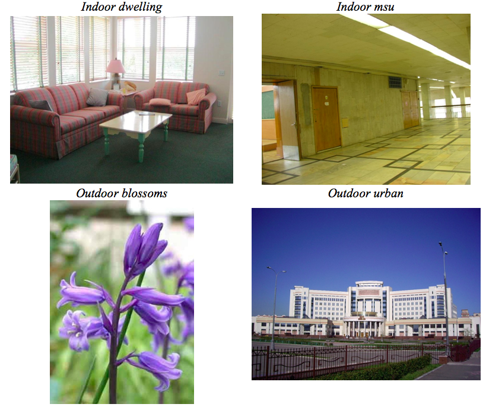
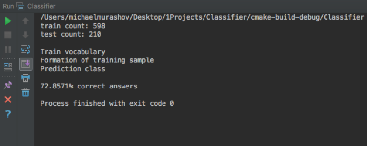

# Classifier

Заданы изображения четырех классов:

- **indoor-dwelling** - домашние сцены внутри помещения.
- **indoor-msu** - офисные сцены внутри помещения.
- **outdoor-blossoms** - уличные сцены с цветами.
- **outdoor-urban** - городские уличные сцены.

Задача состоит в том, чтобы обучить классификатор изображений, который наилучшим образом разделяет этот набор классов.

Примеры изображений:

**Результаты:** Проект запускался с тренировочной выборкой 598 изображений и тестовой выборкой – 210 изображений.
Экспериментальным путем были выбраны оптимальные значения для количества кластеров для словаря (25) и количества 
деревьев (500).

